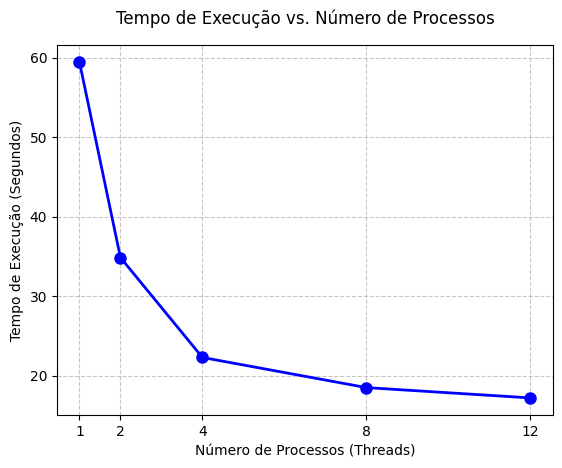
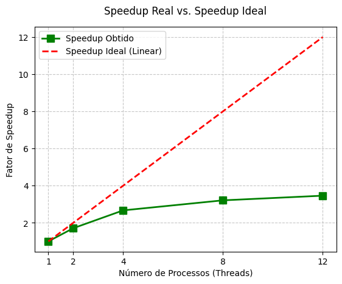
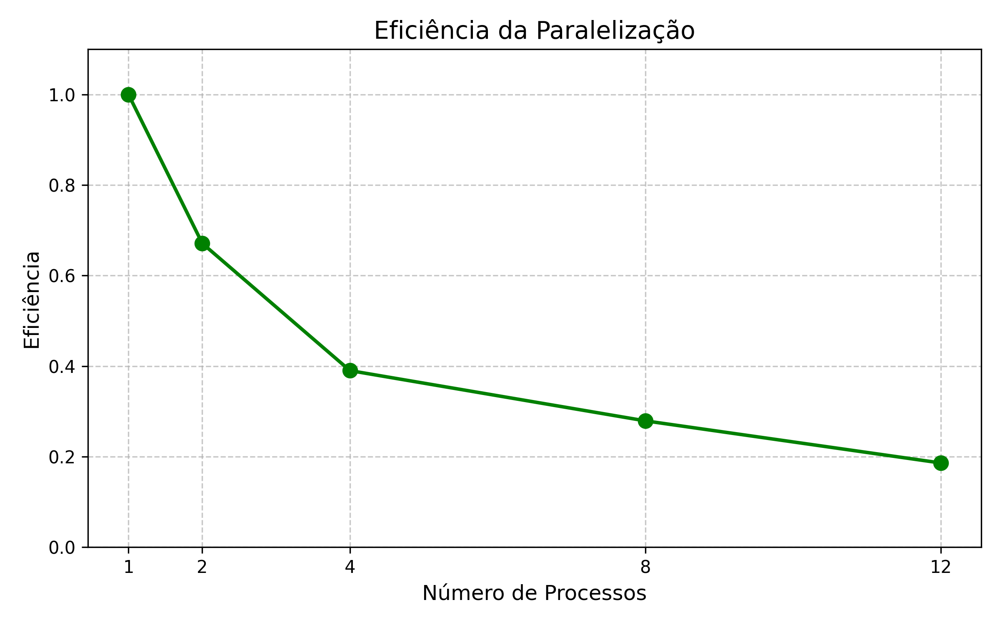

# Relatório de Atividade: Programação Concorrente

**Disciplina:** Programação Concorrente
**Aluno:** Arthur Dias e Victor Hugo
**Instituição:** Centro Universitário Unieuro
**Curso:** Análise e Desenvolvimento de Sistemas (ADS)
**Data:** 09 de Maio de 2026

---

# 1. Descrição do Problema

Este trabalho aborda a paralelização do algoritmo **K-Means Clustering** aplicado ao dataset **CICIDS2017**. O problema consiste em agrupar milhões de fluxos de rede para identificar padrões de comportamento (anomalias e intrusões).

https://www.kaggle.com/datasets/ericanacletoribeiro/cicids2017-cleaned-and-preprocessed

* **Algoritmo:** K-Means Iterativo com Redução Global.
* **Volume de Dados:** Matriz de **2.520.751 linhas x 52 colunas**.
* **Objetivo:** Reduzir o tempo de processamento matemático utilizando o padrão de *Data Parallelism* e avaliar os limites de escalabilidade do hardware.

---

# 2. Ambiente Experimental

| Item                        | Descrição |
| --------------------------- | --------- |
| Processador                 | 6-Core Processor |
| Memória RAM                 | 32,0 GB |
| Sistema Operacional         | Windows  |
| Linguagem utilizada         | Python 3.13.7 |
| Biblioteca de paralelização | `multiprocessing` |

---

# 3. Metodologia de Testes

Os testes foram realizados isolando o tempo de **CPU (Processamento)** do tempo de **I/O (Leitura)**. O cronômetro foi acionado apenas após a carga completa dos dados na RAM.

* **Métricas:** Tempo de Execução (s), Speedup e Eficiência.
* **Cargas Testadas:** 1, 2, 4, 8 e 12 processos.
* **Iterações:** 10 iterações globais para cada teste.

---

# 4. Resultados Experimentais

| Nº Processos | Tempo de Execução (s) |
| :----------: | :-------------------: |
| 1 (Serial)   | 82.98                 |
| 2            | 61.79                 |
| 4            | 53.07                 |
| 8            | 37.16                 |
| 12           | 37.13                 |

---

# 5. Cálculo de Speedup e Eficiência

| Processos | Tempo (s) | Speedup | Eficiência |
| :-------: | :-------: | :-----: | :--------: |
| 1         | 82.98     | 1.00x   | 1.00       |
| 2         | 61.79     | 1.34x   | 0.67       |
| 4         | 53.07     | 1.56x   | 0.39       |
| 8         | 37.16     | 2.23x   | 0.28       |
| 12        | 37.13     | 2.23x   | 0.19       |

---

# 6. Análise dos Resultados

A aplicação demonstrou um comportamento clássico de paralelização de carga de matrizes pesadas, com pontos altos e restrições de arquitetura visíveis:

1) **A Escalabilidade:** O sistema escalou bem inicialmente, reduzindo o tempo de execução de 82.98s (Serial) para 37.15s (8 Processos). O Speedup máximo obtido (2.23x) esteve abaixo do ideal teórico linear, o que é esperado em algoritmos iterativos (como o K-Means), pois a etapa de Redução Global e a Sincronização por Barreira criam gargalos seriais impossíveis de paralelizar (Lei de Amdahl).

2) **O Declínio da Eficiência:** A eficiência começou a cair drasticamente logo na transição para 4 processos (atingindo 39%). Esse fenômeno é causado diretamente pelo Overhead de IPC (Inter-Process Communication). A biblioteca do Python necessita realizar a cópia e serialização das matrizes entre os trabalhadores, consumindo tempo valioso do sistema operacional.

3) **A Saturação de Hardware:** O ponto mais importante do experimento reside na transição de 8 para 12 processos, onde o tempo foi estritamente igual (~37.1 segundos), zerando o ganho de Speedup e afundando a eficiência para 18.6%. A principal causa técnica para este platô é o estrangulamento da largura de banda da memória (Memory Bandwidth Bottleneck). Os núcleos da CPU passaram a computar a matemática mais rápido do que a memória RAM conseguia entregar as fatias da matriz de 52 dimensões. Ademais, o chaveamento de contexto no agendador do SO para gerenciar 12 processos gerou uma contenção que anulou a adição dos novos núcleos.
---

# 7. Gráfico de Tempo de Execução

Construa um gráfico mostrando o **tempo de execução em função do número de threads/processos**.

## Orientações

* Eixo X: número de threads/processos
* Eixo Y: tempo de execução (segundos)

Inserir o gráfico abaixo:

---

# 8. Gráfico de Speedup

Construa um gráfico mostrando o **speedup obtido**.

## Orientações

* Eixo X: número de threads/processos
* Eixo Y: speedup
* Incluir também a **linha de speedup ideal (linear)** para comparação

Inserir o gráfico abaixo:

---

# 9. Gráfico de Eficiência

Construa um gráfico mostrando a **eficiência da paralelização**.

## Orientações

* Eixo X: número de threads/processos
* Eixo Y: eficiência
* Valores entre 0 e 1

Inserir o gráfico abaixo:

---

# 10. Conclusão

O paralelismo trouxe um ganho real de **2.23x** de velocidade. O "ponto ideal" para este hardware foi de **8 processos**. Acima disso, o custo de gerenciar novos processos anula o ganho computacional.
O experimento validou a estratégia de Data Parallelism, provando que a execução concorrente em processadores multicore entrega um ganho de desempenho crítico (mais de 50% de redução no tempo) em tarefas de HPC e Big Data. O melhor desempenho absoluto e a melhor relação de custo-benefício (Sweet Spot) para este hardware específico ocorreu com 8 processos trabalhadores.

Aumentar o número de threads/processes indiscriminadamente sem avaliar os limites do barramento do hardware provou-se ineficaz, confirmando os princípios teóricos da disciplina. Para escalar este problema ainda mais e otimizar a implementação, a solução ideal seria abandonar a CPU e portar a rotina para GPGPU (usando CUDA), paralelizando as operações de matrizes nativamente em milhares de núcleos menores com memória VRAM dedicada.

